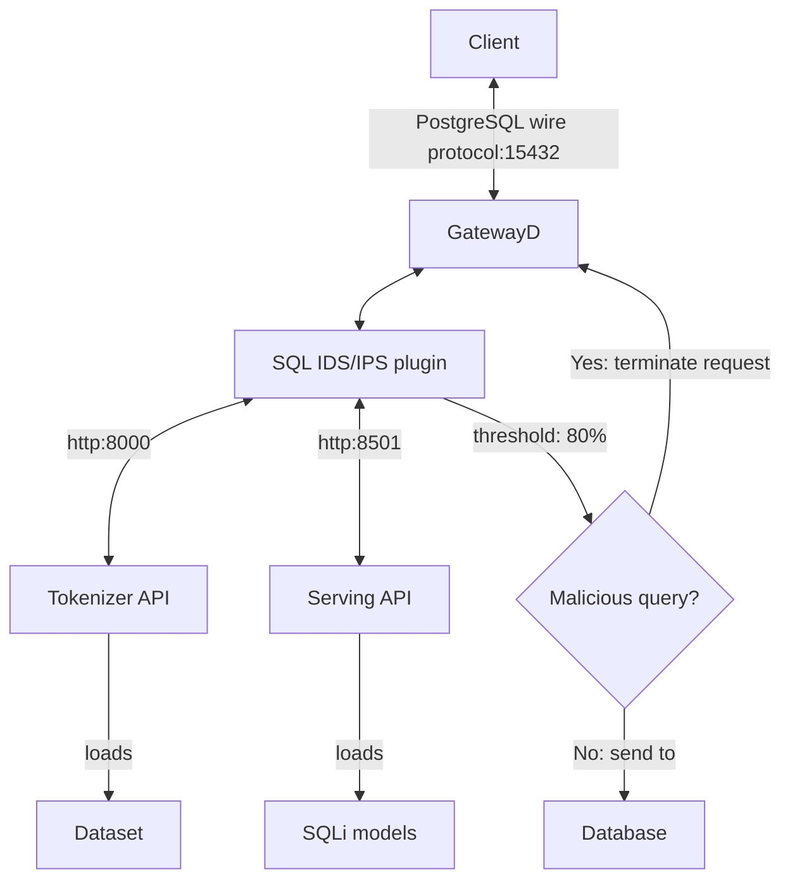

# DeepSQLi

This repository contains the code for the DeepSQLi project. The project aims to detect SQL injection attacks using deep learning models. The project consists of two main components: **Tokenizer API** and **Serving API**. The Tokenizer API tokenizes and sequences the input query, while the Serving API predicts whether the query is SQL injection or not.

The Tokenizer API is built using Flask and TensorFlow, and the Serving API is built using TensorFlow Serving. The Tokenizer API is responsible for tokenizing and sequencing the input query using the corresponding [dataset](./dataset/), and the Serving API is responsible for predicting whether the query is SQL injection or not using the trained deep learning [model](./sqli_model/).

The project also includes a [SQL IDS/IPS plugin](https://github.com/gatewayd-io/gatewayd-plugin-sql-ids-ips) that integrates with the GatewayD database gatewayd. The plugin serves as a frontend for these APIs. It intercepts the incoming queries and sends them to the Serving API for prediction. If the query is predicted as SQL injection, the plugin terminates the request; otherwise, it forwards the query to the database.

The following diagram shows the architecture of the project:



There are currently two models available and trained using the [dataset](./dataset/). Both models are trained using the same model architecture, but they are trained using different datasets. The first model is trained using the [SQLi dataset v1](./dataset/sqli_dataset1.csv), and the second model is trained using the [SQLi dataset v2](./dataset/sqli_dataset2.csv). The models are trained using the following hyperparameters:

- Model architecture: LSTM (Long Short-Term Memory)
- Embedding dimension: 128
- LSTM units: 64
- Dropout rate: 0.2
- Learning rate: 0.001
- Loss function: Binary crossentropy
- Optimizer: Adam
- Metrics: Accuracy, precision, recall, and F1 score
- Validation split: 0.2
- Dense layer units: 1
- Activation function: Sigmoid
- Maximum sequence length: 100
- Maximum number of tokens: 10000
- Maximum number of epochs: 11
- Batch size: 32

## Installation

The fastest way to get started is to use Docker and Docker Compose. If you don't have Docker installed, you can install it by following the instructions [here](https://docs.docker.com/get-docker/).

### Docker Compose

Use the following command to build and run the Tokenizer and Serving API containers using Docker Compose (recommended). Note that `--build` is only needed the first time, and you can omit it later.

```bash
docker compose up --build -d
```

To stop the containers, use the following command:

```bash
docker compose stop
```

To remove the containers and release their resources, use the following command:

```bash
docker compose down
```

### Docker

#### Build the images

```bash
docker build --no-cache --tag tokenizer-api:latest -f Dockerfile.tokenizer-api .
docker build --no-cache --tag serving-api:latest -f Dockerfile.serving-api .
```

#### Run the containers

```bash
docker run --rm --name tokenizer-api -p 8000:8000 -d tokenizer-api:latest
docker run --rm --name serving-api -p 8500-8501:8500-8501 -d serving-api:latest
```

### Test

You can test the APIs using the following commands:

#### Tokenizer API

```bash
# Tokenize and sequence the query
curl 'http://localhost:8000/tokenize_and_sequence' -X POST -H 'Accept: application/json' -H 'Content-Type: application/json' --data-raw '{"query":"select * from users where id = 1 or 1=1"}'
```

#### Serving API

```bash
# Predict whether the query is SQLi or not
curl 'http://localhost:8501/v1/models/sqli_model:predict' -X POST -H 'Accept: application/json' -H 'Content-Type: application/json' --data-raw '{"inputs":[[0,0,0,0,0,0,0,0,0,0,0,0,0,0,0,0,0,0,0,0,0,0,0,0,0,0,0,0,0,0,0,0,0,0,0,0,0,0,0,0,0,0,0,0,0,0,0,0,0,0,0,0,0,0,0,0,0,0,0,0,0,0,0,0,0,0,0,0,0,0,0,0,0,0,0,0,0,0,0,0,0,0,0,0,0,0,0,0,0,0,0,1,2,21,4,32,3,10,3,3]]}'
```

#### One-liner

```bash
# Or you can use the following one-liner:
curl -s 'http://localhost:8501/v1/models/sqli_model:predict' -X POST -H 'Accept: application/json' -H 'Content-Type: application/json' --data-raw '{"inputs":['$(curl -s 'http://localhost:8000/tokenize_and_sequence' -X POST -H 'Accept: application/json' -H 'Content-Type: application/json' --data-raw '{"query":"select * from users where id = 1 or 1=1"}' | jq -c .tokens)']}' | jq
```
