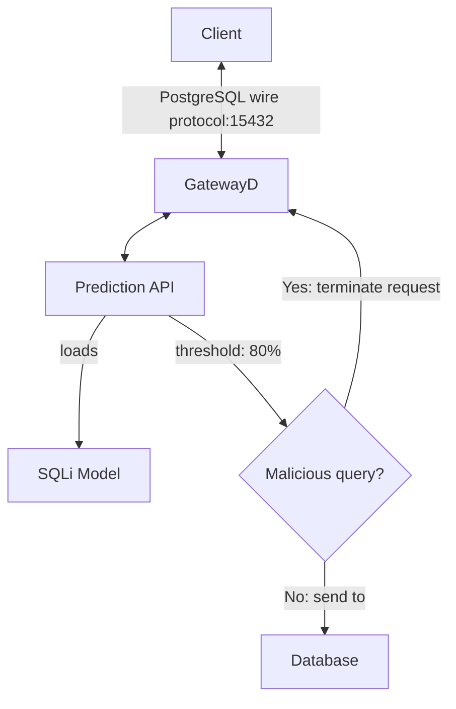

# DeepSQLi

**DeepSQLi** is a project designed to detect SQL injection (SQLi) attacks using deep learning models. It provides a **Prediction API**, a Flask application that tokenizes and sequences SQL queries, and then predicts whether a query is an SQL injection.

## Project Overview

The **Prediction API** handles both tokenization and prediction in a single endpoint, simplifying the detection workflow. It processes incoming SQL queries and determines if they contain SQL injection patterns.

### GatewayD Integration

This project can be integrated with [GatewayD](https://github.com/gatewayd-io/gatewayd) using the [GatewayD SQL IDS/IPS plugin](https://github.com/gatewayd-io/gatewayd-plugin-sql-ids-ips). The plugin acts as a middleware between clients and the database, intercepting SQL queries and sending them to the Prediction API for analysis. If a query is classified as malicious by the Prediction API, the plugin blocks the query; otherwise, it forwards the query to the database.

### Architecture



## Models and Tokenization

### Model Versions

- **LSTM Models**: The first two models are LSTM-based and are trained using different datasets:
  - **`sqli_model/1`**: Trained on dataset v1 (for historical purposes, will remove in the future).
  - **`sqli_model/2`**: Trained on dataset v2 (for historical purposes, will remove in the future).

- **CNN-LSTM Model**: The third model, **`sqli_model/3`**, is a hybrid CNN-LSTM model with a custom SQL tokenizer to improve performance on SQL injection patterns (recommended).

### Tokenization

The Prediction API performs tokenization internally:

- **Default Tokenizer** (Models 1 and 2): Uses Keras’s `Tokenizer` for general tokenization.
- **Custom SQL Tokenizer** (Model 3): A custom tokenizer designed to handle SQL syntax and injection-specific patterns.

## Installation

### Docker Compose

To start the Prediction API with Docker Compose:

```bash
docker compose up --build -d
```

To stop and remove the containers:

```bash
docker compose down
```

### Docker (Manual Setup)

#### Build Images

```bash
docker build --no-cache --tag prediction-api:latest -f Dockerfile .
```

#### Run the Container

```bash
docker run --rm --name prediction-api -p 8000:8000 -d prediction-api:latest
```

## Usage

Once the Prediction API is running, use the `predict` endpoint to classify SQL queries.

### Prediction API

```bash
curl 'http://localhost:8000/predict' -X POST -H 'Content-Type: application/json' \
--data-raw '{"query":"SELECT * FROM users WHERE id=1 OR 1=1;"}'
```

### Response Format

The response includes the prediction (`1` for SQL injection, `0` for legitimate query) and confidence score. Note that the confidence score is only available for the CNN-LSTM model using the Prediction API.

```json
{
    "confidence": 0.9722,
}
```
